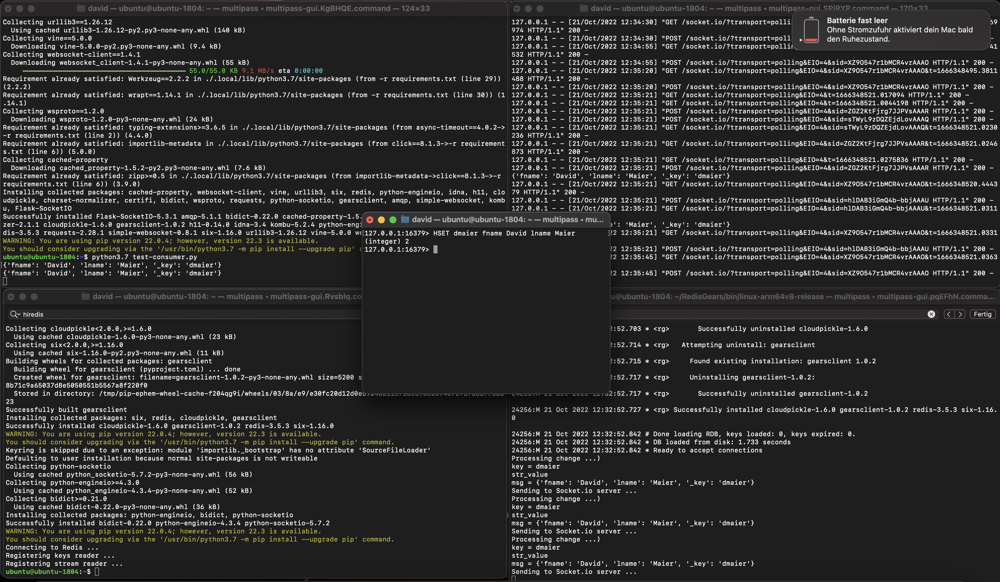

# Redis Gears (v1) and Socket.io

This repo contains some example code that shows how to use Redis Gears to send Socket.io messages.

## Prerequisites 

* Python 3.7
* Redis Server 6.2
* Redis Gears 1.2.5

Apple Silicon machines don't come with Python 3.7 out of the box. So if you run an M1/M2 then the following might be helpful to set a development/testing environment up.

1. Install Multipass
2. Install Ubuntu 18.04 via Multipass
3. Ubuntu 18.04 comes with Python 3.6, so you need to install Python 3.7 manually
4. Ensure that the Python package manager (pip) is present: `python3.7 -m ensurepip`
5. Check the source code of Redis 6.2 out and build for ARM within your Ubuntu 18.04 VM
6. Check the source of RedisGears 1.2.5 out and build it based on instructions here: https://oss.redis.com/redisgears/1.2/quickstart.html
7. Install the requirements as stated in the requirements.txt file to your Python environment
8. Copy all the source code files from your host machine to your VM

## Start Redis

The following Redis servers will be needed for this demo:

1. **Redis Server as queue backend of the SocketIO server**: Our SocketIO server will be configured to use Redis PubSub. This server listens on port 6379: `$REDIS_62_SRC/src/redis-server`
2. **Source Redis Server**: Data changes are originating from this Redis database. The Gear will send them then via the Socket.io protocol to the Socket.io server. We need to start this server with Gears support. It listens on port 16370: `$REDIS_62_SRC/src/redis-server --port 16379 --loadmodule $RG_125_SRC/bin/linux-arm64v8-release/redisgears.so Plugin $RG_125_SRC/bin/linux-arm64v8-release/gears_python/gears_python.so`

(e.g., `cd $HOME/RedisGears/bin/linux-arm64v8-release; $HOME/redis/src/redis-server --port 16379 --loadmodule $PWD/redisgears.so Plugin $PWD/gears_python/gears_python.so)`)

## Start the Socket.io server

1. Execute `python3.7 socketio-server.py`
2. Run the test consumer `python3.7 test_consumer.py`
3. Check if the Socket.io server is working by executing the 'test_producer.py' Python script. This should print the messages out on the consumer side.

## Deploy the Gear

Execute the deployment script: `./deploy_gear.bash`. It connects to the Redis Server that runs Redis Gears, sends the pickled source code of the Gears over and registers them.

## Test it

1. Connect to the database server that listens on port 16379 and execute the following command `HSET dmaier fname David lname Maier `.
2. You should see that the Socket.io consumer prints the following out: `{'fname': 'David', 'lname': 'Maier', '_key': 'dmaier'}`.

The following screenshot shows the Socket.io consumer in the upper left corner, the Socket.io server in the upper right corner and the Redis server debug output in the lower right corner. The window in the center was used to execute the HSET command. It's visible that it got propagated to the Socket.io consumer.

